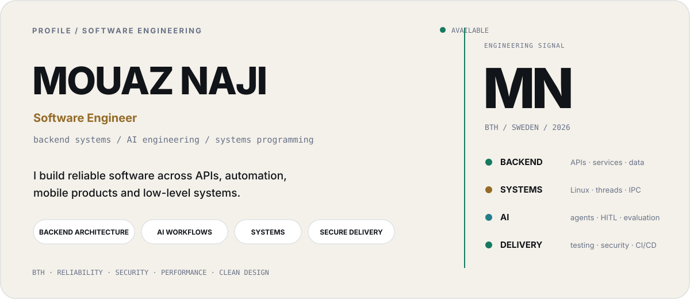
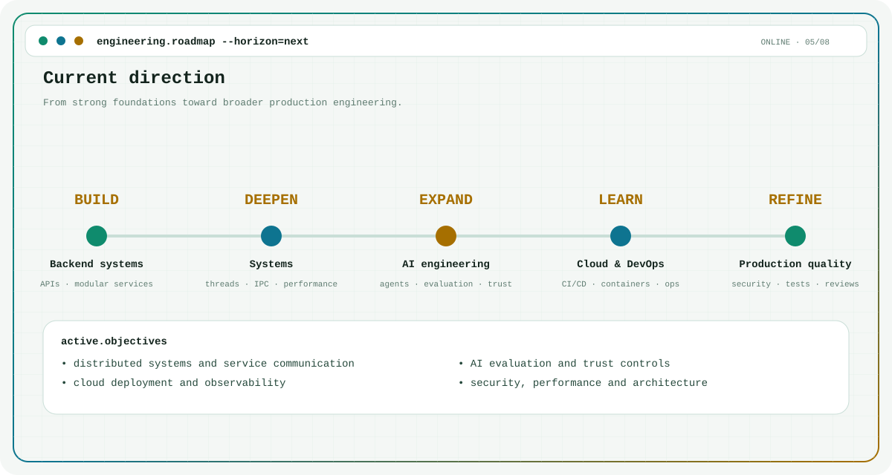

<a id="top"></a>

<picture>
  <source media="(prefers-color-scheme: dark)" srcset="./dark.svg">
  
</picture>

<p align="center">
  <a href="https://github.com/Mouaz7"></a>
  <a href="https://www.linkedin.com/in/mouaz-naji-9307531b6/"></a>
  
  
</p>

<p align="center">
  <a href="#boot"><code>boot</code></a> ·
  <a href="#architecture"><code>architecture</code></a> ·
  <a href="#projects"><code>projects</code></a> ·
  <a href="#toolchain"><code>toolchain</code></a> ·
  <a href="#education"><code>education</code></a> ·
  <a href="#roadmap"><code>roadmap</code></a> ·
  <a href="#contact"><code>contact</code></a>
</p>

---

<a id="boot"></a>

## `mouaz@github:~$ ./boot-profile --verbose`

```console
[  OK  ] identity.mount        Mouaz Naji
[  OK  ] role.service          Software Engineer
[  OK  ] education.target      Software Engineering @ BTH
[  OK  ] location.socket       Sweden
[  OK  ] focus.pipeline        backend → systems → architecture → generative AI
[ LIVE ] status                learning · building · verifying · shipping
```

I build dependable software from API boundaries down to threads, filesystems and network behavior. My strongest work connects several engineering layers: backend services with automation, AI agents with safety controls, mobile products with cloud data, and low-level systems where correctness and resource handling matter.

```ini
PRIMARY     = backend systems | software architecture | generative AI
SYSTEMS     = Linux | processes | threads | IPC | filesystems | networking
LANGUAGES   = Python | C++ | C | Java | TypeScript | JavaScript | Kotlin
PRINCIPLES  = reliability | security | maintainability | measured performance
```

> `policy:` evidence over labels — repositories, architecture decisions, tests, failure handling and observable behavior.

---

<a id="architecture"></a>

## `mouaz@github:~$ systemctl status engineering.service`

<picture>
  <source media="(prefers-color-scheme: dark)" srcset="./assets/system-map-dark.svg">
  
</picture>

```console
● engineering.service - Mouaz Engineering Runtime
     Loaded: loaded (/etc/mouaz/engineering.service)
     Active: active (building)
     Scope : backend · AI · systems · security · data · delivery
     Policy: design → implement → test → observe → improve
```

| Unit | State | Evidence |
| :-- | :--: | :-- |
| `backend.service` | `ACTIVE` | APIs, authentication, validation, persistence and modular services |
| `ai-orchestration.service` | `ACTIVE` | Agent pipelines, model fallback, log analysis and human approval |
| `systems.service` | `ACTIVE` | POSIX threads, mutexes, semaphores, IPC, paging and filesystems |
| `security-gates.service` | `ACTIVE` | Secret scanning, protected paths, static analysis and regression blocking |
| `data.service` | `ACTIVE` | SQL, Firebase, realtime state, schema design and external integrations |
| `product.service` | `ACTIVE` | Android, React, TypeScript, C++ interfaces and user-state feedback |

<details>
<summary><code>mouaz@github:~$ cat /etc/mouaz/engineering-principles.yml</code></summary>

```yaml
architecture:
  - separate responsibilities before adding features
  - keep dependencies explicit and directional
  - design interfaces around behavior, not implementation details

reliability:
  - treat failure as a normal system state
  - use limits, retries, deduplication and auditability where needed
  - prefer observable workflows over silent automation

security:
  - validate inputs and protect credentials
  - apply least privilege and protected paths
  - keep humans in control of high-impact automated decisions

quality:
  - test behavior and failure paths
  - optimize after measuring
  - keep code reviewable under pressure
```

</details>

---

<a id="projects"></a>

## `mouaz@github:~$ ls -lah ~/projects --sort=impact`

<picture>
  <source media="(prefers-color-scheme: dark)" srcset="./assets/project-console-dark.svg">
  
</picture>

| Mode | Project | Runtime | Engineering proof |
| :--: | :-- | :-- | :-- |
| `SOURCE` | **[Auto-Healing AI DevOps](https://github.com/Mouaz7/auto-healing-devops-platform)** | Python · LLMs · Jenkins · Docker | Six-agent remediation pipeline, HITL, traffic-light controls, security and quality gates |
| `SOURCE` | **[Campus360](https://github.com/Mouaz7/Campus360)** | Kotlin · Android · Firebase · Google Maps | Hybrid indoor/outdoor navigation, MVVM, Clean Architecture and authenticated state |
| `SHOWCASE` | **[PongPal](https://github.com/Mouaz7/PongPal-Showcase)** | React · TypeScript · Slack · Firebase · Python | Realtime booking, Slack commands, statistics and Raspberry Pi integration; source remains internal |
| `SOURCE` | **[Chess Game](https://github.com/Mouaz7/chess-game)** | C++20 · SFML 3.0 · vcpkg | Complete rule engine, timers, history, polymorphism, RAII and state-driven UI |
| `SOURCE` | **[Concurrency Systems](https://github.com/Mouaz7/Concurrency-Systems)** | C · POSIX · Linux | Processes, pthreads, mutexes, semaphores, shared memory, message queues and paging |
| `SOURCE` | **[OS Filesystem](https://github.com/Mouaz7/Os_filesystem)** | C++ · FAT · Linux · Make | Virtual block storage, hierarchical directories, path resolution, permissions and shell commands |

<details>
<summary><code>mouaz@github:~/projects$ find . -maxdepth 1 -type d --more</code></summary>

| Repository | Focus |
| :-- | :-- |
| **[Cpp-TransportSystem](https://github.com/Mouaz7/Cpp-TransportSystem)** | OOP, scheduling constraints, validation and file persistence |
| **[network-udp-tcp-analysis](https://github.com/Mouaz7/network-udp-tcp-analysis)** | Throughput, packet loss, ordering and protocol behavior |
| **[ARM-UART-Factorial](https://github.com/Mouaz7/ARM-UART-Factorial)** | ARM assembly, UART input/output and factorial calculation |
| **[ARM-Interrupt-UART-Display](https://github.com/Mouaz7/ARM-Interrupt-UART-Display)** | Interrupt-driven embedded communication and display output |
| **[Asm-Buffered-IO](https://github.com/Mouaz7/Asm-Buffered-IO)** | Low-level buffered input/output |
| **[team-temp-app](https://github.com/Mouaz7/team-temp-app)** | Visual documentation for an AI-driven employee survey platform |
| **[All public repositories →](https://github.com/Mouaz7?tab=repositories)** | Full project inventory |

</details>

---

<a id="toolchain"></a>

## `mouaz@github:~$ cat /etc/mouaz/toolchain.conf`

```ini
[LANGUAGES]
runtime   = Python, C++, C, Java, TypeScript, JavaScript, Kotlin, Bash

[BACKEND]
services  = REST APIs, Node.js, Express, authentication, validation, error handling

[DATA]
storage   = PostgreSQL, MySQL, MariaDB, SQLite, Firebase, local persistence

[SYSTEMS]
kernel    = Linux, POSIX, processes, pthreads, synchronization, IPC, FAT, networking

[AI]
pipeline  = LLM integration, agents, orchestration, model fallback, HITL, evaluation

[MOBILE_AND_UI]
product   = Android, Kotlin, MVVM, React, responsive interfaces, state-driven UI

[DELIVERY]
tooling   = Git, GitHub, Docker, Jenkins, CI/CD, CMake, static analysis, review gates
```

<details>
<summary><code>mouaz@github:~$ ./render-tool-icons --optional</code></summary>

<p align="center">
  <picture>
    <source media="(prefers-color-scheme: dark)" srcset="https://skillicons.dev/icons?i=python,cpp,c,java,js,ts,kotlin,bash&theme=dark">
    
  </picture>
</p>

<p align="center">
  <picture>
    <source media="(prefers-color-scheme: dark)" srcset="https://skillicons.dev/icons?i=react,nextjs,nodejs,express,postgres,mysql,sqlite,firebase&theme=dark">
    
  </picture>
</p>

<p align="center">
  <picture>
    <source media="(prefers-color-scheme: dark)" srcset="https://skillicons.dev/icons?i=linux,docker,git,github,cmake,androidstudio,vscode&theme=dark">
    
  </picture>
</p>

</details>

---

<a id="education"></a>

## `mouaz@github:~$ tree ~/education/software-engineering`

```text
Software Engineering @ BTH
├── foundation
│   ├── Python, C, C++ and Java
│   ├── algorithms and data structures
│   ├── object-oriented design
│   └── discrete and computational problem solving
├── systems
│   ├── operating systems
│   ├── processes, threads and IPC
│   ├── computer networks
│   ├── embedded and assembly programming
│   └── performance and resource management
├── software-engineering
│   ├── requirements engineering
│   ├── architecture and design patterns
│   ├── verification, validation and testing
│   ├── team-based development
│   └── maintainability and quality
└── data-security-ai
    ├── database technology
    ├── security and cryptography
    ├── artificial intelligence
    ├── generative AI integrations
    └── safe automation and human control
```

---

<a id="roadmap"></a>

## `mouaz@github:~$ ps aux --sort=-priority`

<picture>
  <source media="(prefers-color-scheme: dark)" srcset="./assets/roadmap-dark.svg">
  
</picture>

```console
PID   STATE      PROCESS
101   RUNNING    backend.systems        reliable APIs and modular application services
202   RUNNING    ai.devtools            controlled agents, repair workflows and evaluation
303   LEARNING   distributed.systems    service communication, resilience and observability
404   ACTIVE     security.practice      secure defaults, quality gates and review controls
505   ACTIVE     performance.lab        concurrency, networking and measurable behavior
606   READY      open.source            useful collaboration and production-quality shipping
```

<details>
<summary><code>mouaz@github:~$ git stats --details</code></summary>

<p align="center">
  <picture>
    <source media="(prefers-color-scheme: dark)" srcset="https://github-readme-stats.vercel.app/api?username=Mouaz7&show_icons=true&hide_border=true&bg_color=06100E&title_color=D9B963&text_color=ECF8F3&icon_color=38D6AE&ring_color=5BC9D7">
    
  </picture>
  <picture>
    <source media="(prefers-color-scheme: dark)" srcset="https://github-readme-stats.vercel.app/api/top-langs/?username=Mouaz7&layout=compact&hide_border=true&bg_color=06100E&title_color=D9B963&text_color=ECF8F3">
    
  </picture>
</p>

</details>

---

<a id="contact"></a>

## `mouaz@github:~$ ./connect --protocol=https`

```console
TARGETS   backend engineering · system design · AI-assisted development
INTERESTS secure automation · performance · open source · reliable architecture
STATUS    available for technical conversations and engineering collaboration
```

<p align="center">
  <a href="https://www.linkedin.com/in/mouaz-naji-9307531b6/"></a>
  <a href="https://github.com/Mouaz7?tab=repositories"></a>
</p>

```console
mouaz@github:~$ echo "Build carefully. Verify honestly. Improve continuously."
```

<p align="right"><a href="#top"><code>back-to-top ↑</code></a></p>
