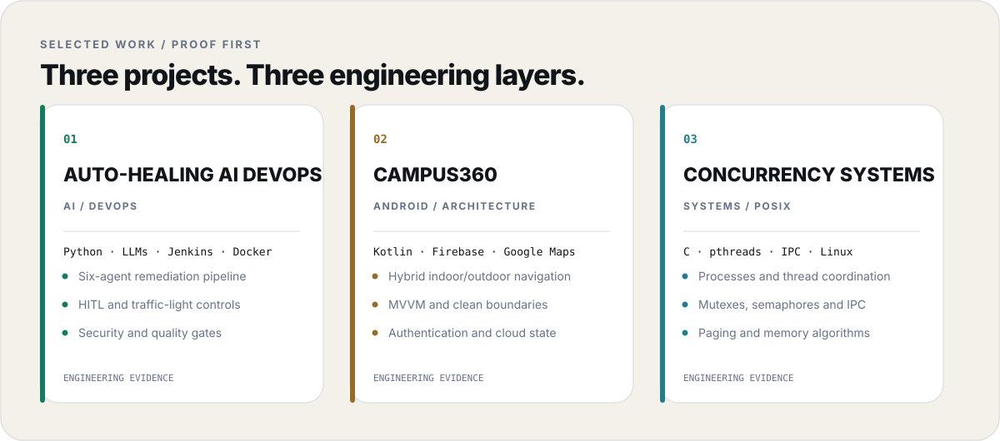
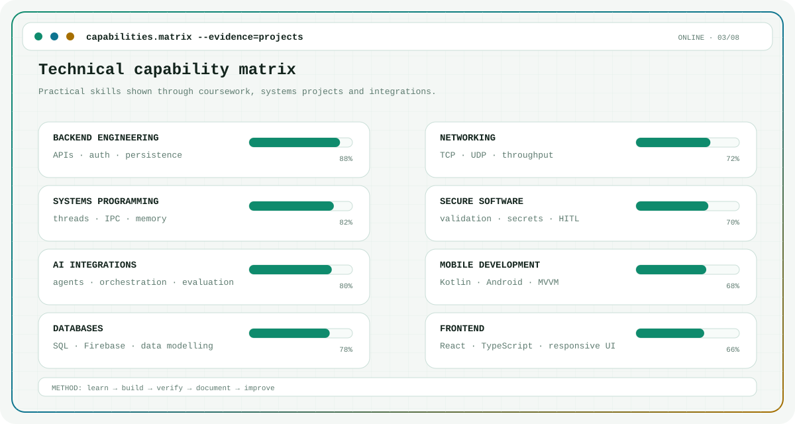

<picture>
  <source media="(prefers-color-scheme: dark)" srcset="./dark.svg">
  
</picture>

  <a href="https://github.com/Mouaz7?tab=repositories"><b>Repositories</b></a>
  &nbsp;&nbsp;·&nbsp;&nbsp;
  <a href="https://www.linkedin.com/in/mouaz-naji-9307531b6/"><b>LinkedIn</b></a>
  &nbsp;&nbsp;·&nbsp;&nbsp;
  <a href="https://www.bth.se/utbildning/program/software-engineering-180-hp"><b>BTH Software Engineering</b></a>

 

<picture>
  <source media="(prefers-color-scheme: dark)" srcset="./assets/work-dark.svg">
  
</picture>

  <a href="https://github.com/Mouaz7/auto-healing-devops-platform"><b>Auto-Healing AI DevOps</b></a>
  &nbsp;&nbsp;·&nbsp;&nbsp;
  <a href="https://github.com/Mouaz7/Campus360"><b>Campus360</b></a>
  &nbsp;&nbsp;·&nbsp;&nbsp;
  <a href="https://github.com/Mouaz7/Concurrency-Systems"><b>Concurrency Systems</b></a>
  &nbsp;&nbsp;·&nbsp;&nbsp;
  <a href="https://github.com/Mouaz7?tab=repositories">More work →</a>

 

<picture>
  <source media="(prefers-color-scheme: dark)" srcset="./assets/capabilities-dark.svg">
  
</picture>

  Build carefully · verify honestly · improve continuously

