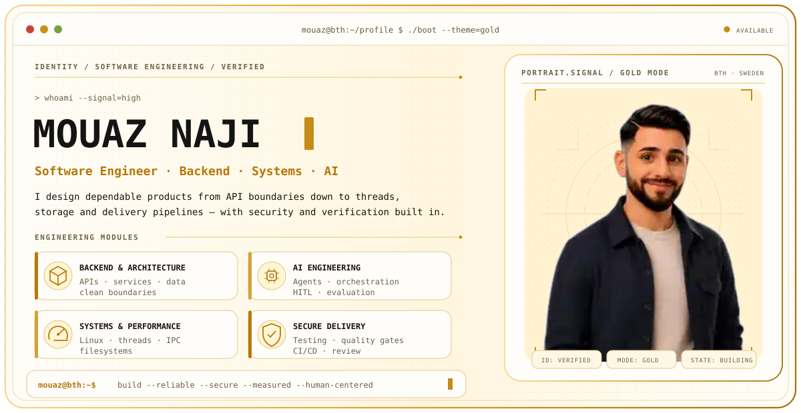
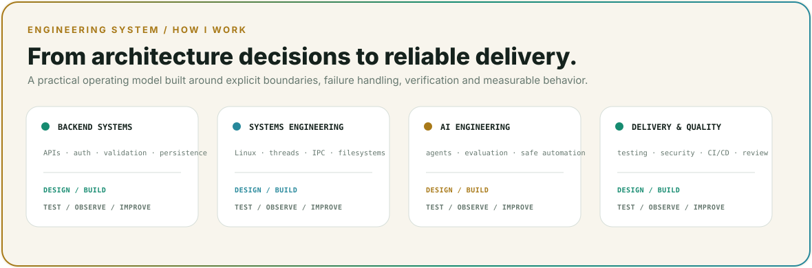
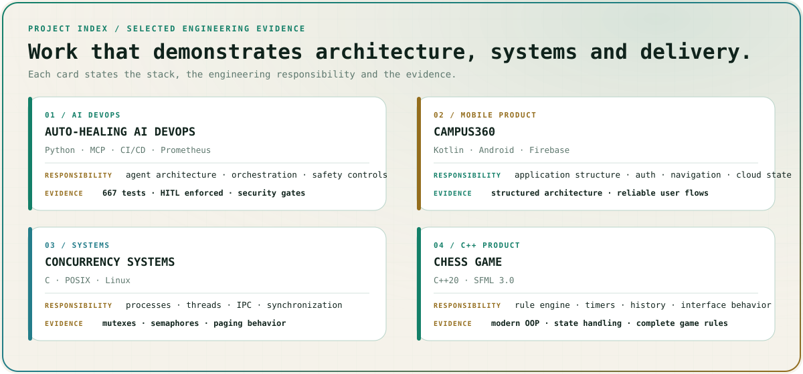
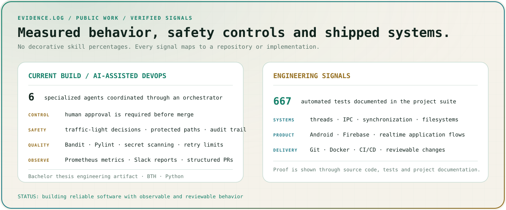
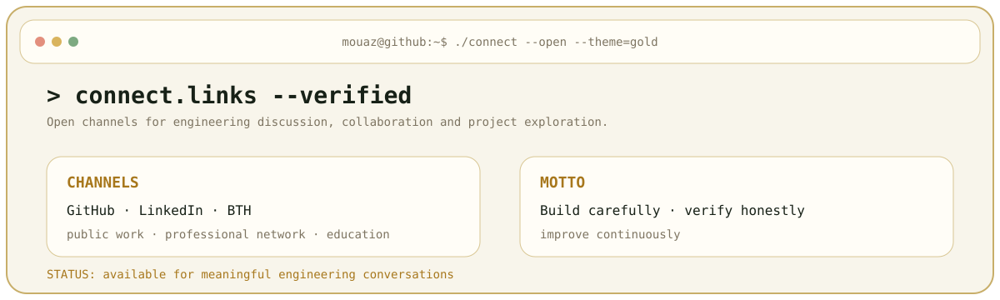

<a id="top"></a>

<picture>
  <source media="(prefers-color-scheme: dark)" srcset="./assets/profile-dark.svg">
  
</picture>

<br>

<div align="center">
  
  
  
  
</div>

<p align="center">
  <a href="#about"><b>✨ About</b></a>
  &nbsp;&nbsp;·&nbsp;&nbsp;
  <a href="#engineering"><b>🧠 Engineering</b></a>
  &nbsp;&nbsp;·&nbsp;&nbsp;
  <a href="#projects"><b>🚀 Projects</b></a>
  &nbsp;&nbsp;·&nbsp;&nbsp;
  <a href="#technology"><b>🛠️ Technology</b></a>
  &nbsp;&nbsp;·&nbsp;&nbsp;
  <a href="#activity"><b>📈 Activity</b></a>
  &nbsp;&nbsp;·&nbsp;&nbsp;
  <a href="#contact"><b>🤝 Contact</b></a>
</p>

---

<a id="about"></a>

## ✨ `mouaz@github:~$ ./about --signal=high`

I am **Mouaz Naji**, a Software Engineering student at **Blekinge Institute of Technology**. I build software across **backend systems, architecture, systems programming, mobile development and AI-assisted engineering workflows**.

```text
🧩 PRIMARY     Backend systems · architecture · generative AI
⚙️ SYSTEMS     Linux · processes · threads · IPC · filesystems · networking
💻 LANGUAGES   Python · C++ · C · Java · TypeScript · JavaScript · Kotlin
🛡️ PRINCIPLES  Reliability · security · maintainability · measured performance
```

> 💡 Evidence over labels: clear architecture, tested behavior, reliable systems and measurable results.

---

<a id="engineering"></a>

## 🧠 `mouaz@github:~$ ./engineering --overview`

<picture>
  <source media="(prefers-color-scheme: dark)" srcset="./assets/engineering-dark.svg">
  
</picture>

| Area | Engineering approach |
| :-- | :-- |
| 🏗️ **Architecture** | Separate responsibilities, keep dependencies explicit and design around behavior |
| 🛡️ **Reliability** | Validate state, handle failures intentionally and make important workflows observable |
| 🔐 **Security** | Protect credentials, use least privilege and review high-impact automation |
| ✅ **Quality** | Test normal and failure paths, measure before optimizing and keep changes reviewable |

---

<a id="projects"></a>

## 🚀 `mouaz@github:~$ ./projects --featured`

<picture>
  <source media="(prefers-color-scheme: dark)" srcset="./assets/projects-dark.svg">
  
</picture>

<p align="center">
  <a href="https://github.com/Mouaz7/auto-healing-devops-platform"></a>
  <a href="https://github.com/Mouaz7/Campus360"></a>
  <a href="https://github.com/Mouaz7/Concurrency-Systems"></a>
</p>

| Project | Engineering evidence |
| :-- | :-- |
| 🤖 **[Auto-Healing AI DevOps](https://github.com/Mouaz7/auto-healing-devops-platform)** | Multi-agent repair workflows, CI/CD controls, approval gates and secure automation |
| 📱 **[Campus360](https://github.com/Mouaz7/Campus360)** | Kotlin, Android, Firebase, authentication, navigation and structured architecture |
| 🏓 **[PongPal](https://github.com/Mouaz7/PongPal-Showcase)** | React, Slack, Firebase and IoT-backed realtime workflows |
| ♟️ **[Chess Game](https://github.com/Mouaz7/chess-game)** | C++20, SFML, rule handling, timers, history and object-oriented design |
| ⚙️ **[Concurrency Systems](https://github.com/Mouaz7/Concurrency-Systems)** | Processes, POSIX threads, mutexes, semaphores, IPC and paging |
| 💾 **[OS Filesystem](https://github.com/Mouaz7/Os_filesystem)** | FAT-style storage, directories, paths, permissions and shell commands |

<p align="center">
  <a href="https://github.com/Mouaz7?tab=repositories"></a>
</p>

---

<a id="technology"></a>

## 🛠️ `mouaz@github:~$ ./stack --inspect`

<picture>
  <source media="(prefers-color-scheme: dark)" srcset="./assets/stack-dark.svg">
  
</picture>

<p align="center">
  
  
  
  
  
  
  
  
</p>

---

<a id="activity"></a>

## 📈 `mouaz@github:~$ ./activity --status`

<picture>
  <source media="(prefers-color-scheme: dark)" srcset="./assets/activity-dark.svg">
  
</picture>

<p align="center">
  <a href="https://github.com/Mouaz7?tab=overview"></a>
  <a href="https://github.com/Mouaz7?tab=repositories"></a>
  <a href="https://github.com/pulls?q=is%3Apr+author%3AMouaz7"></a>
</p>

---

<a id="contact"></a>

## 🤝 `mouaz@github:~$ ./connect --open`

<picture>
  <source media="(prefers-color-scheme: dark)" srcset="./assets/contact-dark.svg">
  
</picture>

<p align="center">
  <a href="https://www.linkedin.com/in/mouaz-naji-9307531b6/" target="_blank" rel="noopener noreferrer"></a>
  <a href="https://github.com/Mouaz7"></a>
  <a href="https://www.bth.se/utbildning/program/software-engineering-180-hp"></a>
</p>

<p align="center"><b>✨ Build carefully · verify honestly · improve continuously ✨</b></p>

<p align="center"><a href="#top"></a></p>
